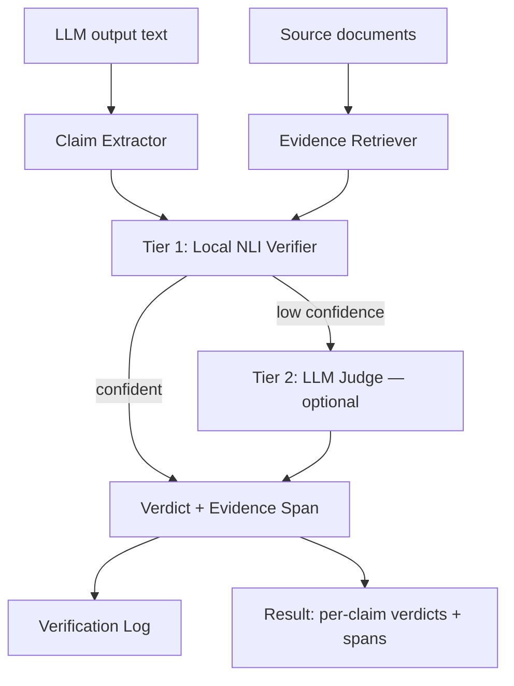
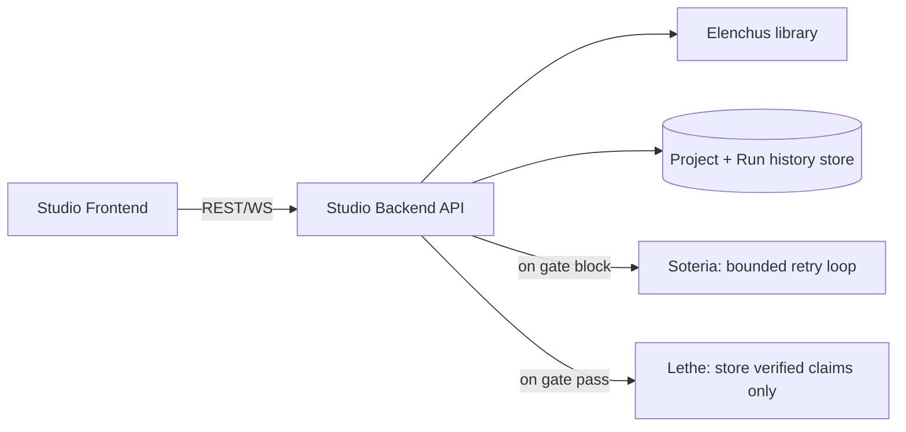

# Elenchus — Architecture

Structure and components. For *why* things are built this way, see Design.md.
For data shapes, see Schema.md. For invariants that must hold regardless of
implementation details, see Rules.md.

## Library pipeline



### Components

- **Claim Extractor** (`elenchus/claim_extractor.py`) — splits output text into
  claims with character-offset spans preserved. v1: sentence-level
  segmentation. Batch extraction, streaming, and benchmark preprocessing use
  the same boundary parser.
- **Evidence Retriever** (`elenchus/evidence_retriever.py`) — finds source
  passages relevant to a claim. v1 enumerates all chunks, ranks them with a
  deterministic local lexical score, builds bounded adjacent-sentence windows
  for compound claims, then returns the configured top-k. Embedding retrieval
  is a later optimization.
- **NLI Verifier / Tier 1** (`elenchus/nli_verifier.py`) — runs a local NLI
  model over `(evidence premise, claim hypothesis)` pairs, returns
  entailment/neutral/contradiction probabilities, and selects the
  strongest-signal passage as the evidence span.
- **LLM Judge / Tier 2** (`elenchus/llm_judge.py`) — optional, injectable,
  called only for claims Tier 1 couldn't confidently resolve.
- **Verifier** (`elenchus/verifier.py`) — orchestrates the above into
  `Verdict` objects; the one place that decides whether to escalate.
- **Verification Log** (`elenchus/verification_log.py`) — append-only record
  of every check, in-memory and SQLite implementations.
- **StreamingVerifier** (`elenchus/streaming.py`) — buffers incoming text
  until a claim boundary is detected, then feeds it through the same
  Verifier used in batch mode. Not a separate pipeline.

## Planned Studio architecture (Phases 5–7)

The components below are design targets and are not present in the current
repository yet.



### Components

- **Studio Backend API** (`studio/api/`) — FastAPI service. Endpoints:
  create project, submit check, retrieve verdicts, list run history,
  configure/evaluate output gate. Calls the Elenchus library the same way
  any external consumer would — no special access to internals.
- **Project + Run history store** (`studio/db/`) — SQLite-backed persistence
  for `Project` and `VerificationRun` records (see Schema.md).
- **Output Gate** (`studio/gate.py`) — a pure function over a run's verdicts,
  configurable per project, producing allowed/blocked/flagged.
- **Comparison view** — not a separate component; the frontend renders
  multiple `VerificationRun`s (same source+question, different
  model/prompt label) side by side.
- **Soteria hook** (`studio/integrations/soteria_hook.py`) — invoked only
  when the gate blocks a run; hands off to a Soteria-managed bounded retry
  loop.
- **Lethe hook** (`studio/integrations/lethe_hook.py`) — invoked only when
  the gate allows a run; writes each supported-verdict claim into a Lethe
  `MemoryStore` via `store.remember()`.
- **Studio Frontend** (`studio/frontend/`) — upload/paste source documents,
  paste an existing candidate answer, view claims color-coded by verdict with
  evidence spans on click, comparison view, run history. Studio v1 has no
  answer-generation flow.

## Repository Structure

```
elenchus/
├── .context/
│   ├── PRD.md
│   ├── Architecture.md          (this file)
│   ├── Design.md
│   ├── Rules.md
│   ├── Schema.md
│   └── Plan.md
├── elenchus/
│   ├── __init__.py
│   ├── claim_extractor.py
│   ├── evidence_retriever.py
│   ├── nli_verifier.py          # Tier 1
│   ├── llm_judge.py             # Tier 2 (optional, injectable)
│   ├── config.py                # VerificationConfig
│   ├── verifier.py              # orchestrates tiers, produces Verdicts
│   ├── streaming.py              # StreamingVerifier
│   ├── verification_log.py      # append-only log, in-memory + SQLite
│   └── rendering.py             # ANSI + HTML span rendering
├── studio/                       # planned; not implemented yet
│   ├── api/                     # FastAPI backend
│   ├── db/                      # Project + VerificationRun persistence
│   ├── gate.py                  # Output Gate
│   ├── integrations/
│   │   ├── soteria_hook.py
│   │   └── lethe_hook.py
│   └── frontend/
├── benchmark/
│   ├── prepare_dataset.py       # RAGTruth preprocessing
│   ├── run_benchmark.py
│   ├── faithbench_stress.py     # RAGTruth implicit-true stress proxy
│   └── RESULTS.md
├── examples/
│   ├── customer_support_demo.py
│   └── streaming_guardrail_demo.py
├── tests/
├── pyproject.toml
└── README.md
```
